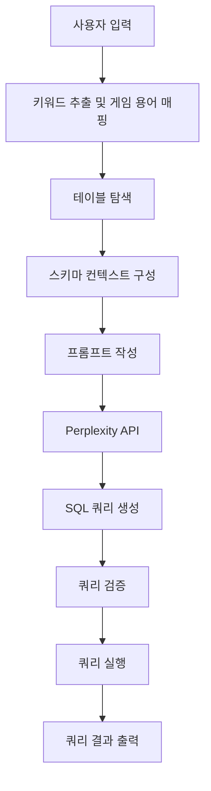

# Text to SQL for Eternal Return

배틀로얄 게임 "[이터널 리턴(Eternal Return)](https://playeternalreturn.com/main?hl=ko-KR)"의 경기 데이터에 대한 자연어 질의를 SQL 쿼리로 자동 변환하는 프로젝트입니다. Perplexity API를 활용하여 SQL 쿼리에 대한 지식이 없어도 데이터 베이스에 저장된 게임 데이터에 대한 조회 및 분석을 쉽게 수행할 수 있도록 도와줍니다.

## 주요 기능

### 자연어 처리 및 SQL 변환
- 한국어 자연어 질의를 MySQL 쿼리로 변환
- 게임 용어를 활용한 키워드 확장 기능
- 복잡한 조인 및 집계 쿼리 생성

### 스키마 관리
- JSON 기반 메타 데이터를 통한 테이블 관계 관리
- 동적 스키마 압축으로 API 호출 효율성 향상
- 컬럼 설명 기반의 자동 테이블 매핑

### 성능 최적화
- **연결 풀링**: `SQLAlchemy QueuePool` 구현
- **스트리밍 처리**: `Perplexity API` 스트리밍 응답
- **지능형 캐싱**: 자연어 질의 및 쿼리 생성 결과 캐싱
- **동적 스키마 로딩**: 질의 관련 테이블만 프롬프트에 사용

## 워크 플로우


## 설치 및 설정

### 프로젝트 설치
```bash
# 저장소 클론
git clone 
cd ER-NL2SQL

# Poetry를 통한 의존성 설치
poetry install

# 가상환경 활성화
poetry shell
```

### 환경 설정
프로젝트 루트에 `.env` 파일을 생성하고 다음 설정 추가
```env
PERPLEXITY_API_KEY=your_api_key
DB_HOST=localhost
DB_USER=your_username
DB_PASSWORD=your_password
DB_NAME=eternal_return_db
DB_PORT=3306
```

## 사용 방법

### 웹 인터페이스
```bash
poetry run streamlit run scripts/streamlit_app.py
```

### 터미널 인터페이스
```bash
poetry run python scripts/app.py
```

### 예제 질의
```
"46 버전에서 가장 많이 사용된 무기 타입별 평균 킬 수"
"특정 캐릭터 조합의 승률"
```

## 기술 스택 및 프로젝트 구조

### 기술 스택 및 언어
`Python`, `MySQL`, `Perplexity Sonar-pro`, `Streamlit`, `Poetry`

### 프로젝트 구조
```
📦 ER_NL2SQL
├─ docs
│  └─ data_discription.json
├─ mapping
│  └─ keyword_mapping.json
├─ scripts
│  ├─ __init__.py
│  ├─ app.py
│  ├─ db_connector.py
│  ├─ json_schema_loader.py
│  ├─ query_generator.py
│  ├─ query_validator.py
│  ├─ schema_compressor.py
│  ├─ schema_embedder.py
│  ├─ schema_mapper.py
│  ├─ streamlit_app.py
│  └─ utils.py
├─ .gitignore
├─ README.md
├─ poetry.lock
└─ pyproject.toml

```
©generated by [Project Tree Generator](https://woochanleee.github.io/project-tree-generator)

## 모듈별 역할
### `TextToSQLApp(app.py)`
- 자연어 질의 처리 파이프라인을 관리
- DB 연결 풀 초기화부터 SQL 생성, 검증, 실행을 조율
- 사용자 입력을 받아 `QueryGenerator`에 전달하고 생성된 쿼리를 `QueryValidator`를 통해 검증한 후 `DatabaseConnector`로 전달해 쿼리를 실행

### `DatabaseConnector(db_connector.py)`
- `SQLAlchemy` 기반 DB 연결 관리 모듈
- 연결 풀링을 통해 동시 접속 효율성을 높이며, 스키마 정보 캐싱 기능을 통해 반복 조회 성능을 최적화

### `QueryGenerator(query_generator.py)`
- `Perplexity AI API`를 활용한 Text to SQL 변환 모듈
- 자연어 처리 단계에서 게임 용어 매핑
- 프롬프트를 통해 쿼리를 생성
- 응답 스트리밍 기능을 통해 실시간으로 생성 결과를 처리
- 쿼리 캐싱 시스템을 통해 반복된 질문을 캐싱하여 최적화

### `QueryValidator(query_validator.py)`
- 생성된 SQL 쿼리의 안전성과 문법적 정확성을 검증
- 정규표현식을 이용한 허용되지 않는 쿼리 패턴 탐지
- 데이터베이스 스키마와의 일치성 검사
- WHERE절 없는 UPDATE/DELETE 구문 차단

### `JsonSchemaLoader(json_schema_loader.py)`
- JSON 형식의 데이터베이스 메타데이터를 파싱
- 테이블 설명과 컬럼 주석을 한국어-영어 매핑 사전으로 변환
- 외래키 관계를 자동 탐지하여 테이블 연결성을 분석

### `SchemaCompressor(schema_compressor.py)`
- API 호출 비용 최적화를 위한 스키마 압축 모듈
- 질의 키워드 분석을 통해 관련 테이블만 필터링 및 중복 제거

### `StreamlitApp(streamlit_app.py)`
- 웹 기반 인터페이스를 제공하는 모듈
